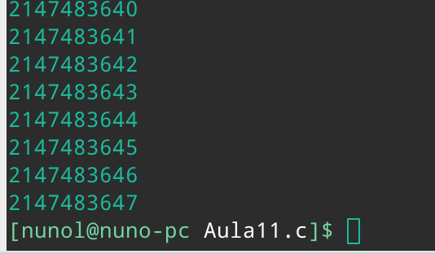
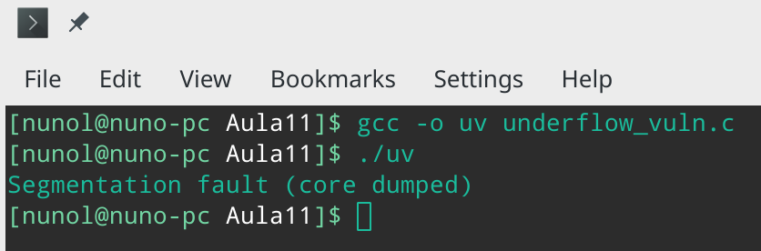

# Aula 11 - Resolução

## Pergunta P1.1

O mesmo programa escrito em várias linguagens, neste caso Java, Python e C++, comporta-se de maneira diferente. Isto é, em todas as implementações do programa, primeiro todos alocam um pedaço de memória estática, com capacidade para armazenar 10 inteiros. De seguida, é solicitado ao utilizador que está a executar o programa, para indicar quantos números inteiros deseja armazenar. Posto isto, o utilizador pode inserir os elementos que pretende guardar, de acordo com o número máximo anteriormente referido.

Contudo, uma vez que o espaço alocado é estático, se o número de elementos que o utilizador desejar armazenar for superior ao número de elementos suportados, isto irá provocar um comportamento anormal de execução do programa, cujo tratamento depende da linguagem em que é implementado.

No caso da implementação em C++, executar o programa para armazenar um número de elementos superior ao que é suportado irá resultar *stack smashing*. Já no programa em Java, a execução deste será interrompida pelo lançamento de uma exceção: *Exception in thread "main" java.lang.ArrayIndexOutOfBoundsException: 10 at LOverflow2.main(LOverflow2.java:18)*. Finalmente, tal como na solução em java, a solução em Python também termina com uma exceção, mais concretamente: *IndexError: list assignment index out of range*.

 
## Pergunta P1.2

O programa *LOverflow3* implementado nas várias linguagens, permite ao utilizador especificar um número de elementos que pretende armazenar. De seguida, são armazenados por ordem decrescente os elementos com início no número especificado pelo utilizador. Posto isto, este pode especificar o elemento ao qual pretende aceder. Contudo, uma vez que não existe controlo sobre o número máximo de elementos que podem ser armazenados, e o espaço de memória é alocado estaticamente, o utilizador pode dispoletar um comportamento anormal da aplicação, indicando um número de elementos que pretende armazenar superior ao que é suportado e previamente alocado, neste caso de 10.

Porém, a forma como este problema é tratado depende da linguagem em que o programa foi implementado. No caso do Java e do Python, é lançada uma exceção, que não permite aceder a posições de memória que não foram alocadas pelo progama. Já no programa em C++, ao introduzir um número máximo de elementos superior ao que é suportado irá deixar o programa a executar indefinidamente, possivelmente pelo valor da variável que é avaliada na condição de verificação do ciclo ser modificado, devido ao acesso a um espaço de endereçamento, que não deve ser usado para armazenar os valores da aplicação.

Para além disto, existe também outro controlo que deve existir para garantir um bom funcionamento da aplicação, que consiste no acesso a uma posição do vetor de elementos armazenados superior aquela que foi introduzida pelo utilizador, neste caso menor do que 10. Isto é, se um utiizador disser que pretende armazenar 2 valores e depois tentar aceder ao que está na posição 3, o resultado poderá variar de acordo com a linguagem em que foi implementada. No caso do C++, uma vez que este vetor não é inicializado, será devolvido o valor que estiver armazenado nesta posição de memória, seja ele qual for, produzindo um comportamento imprevisível. Contudo, uma vez que o Java e o Python inicializam estes vetores, no caso do Java será retornado o valor 0 e no caso do Python *None*.

## Pergunta P1.3

A vulnerabilidade de *Buffer Overflow* presente nestas aplicações é conhecida como *Stack-based buffer overflow*. Esta acontece porque, quando um *array* é declaro em C, o espaço para ele é reservado e o *array* é manipulado através do seu apontador, para o primeiro byte. Contudo, a função `gets` não é segura porque não verifica se os limites do *array* são ultrapassados. Por isso, quando o compilador gera código máquina, para ser executado, o código gerado permite que o programa copie informação, para além dos limites do *array*, alterando o conteúdo das posições de memória adjacentes a este.

Posto isto, para o caso do programa *RootExplooit*, poderá ser usada uma string com mais de 4 caracteres, que corresponde ao espaço reservado para a password introduzida, de modo alterar a informação nas posições de memória adjacentes. Neste caso, alterando o valor da variável `pass` e obter as permissões de root/admin.

Para o caso da aplicação *0-simple*, já será necessário que a string introduzida possua um número máximo de caracteres superior a 64. Desta forma, é possível alterar o valor da variável `control` e consequentemente obter a mensagem "YOU WIN!!!".

## Pergunta P1.4

Após testar e executar o programa `ReadOverflow.c`, podemos concluir que, facilmente, se extrai conhecimento remanescente da memória, executando este programa de forma a que o mesmo seja quebrado. Um exemplo disto é indicar ao programa que pretendemos escrever 20 caratéres, mas quando escrevermos a frase, escrevemos uma que tenha apenas 9 caratéres, por exemplo. O programa ao percorrer o ciclo sem validar se o tamanho da frase é, de facto, igual ao tamanho inicialmente indicado, para além de imprimir os caratéres inseridos, também vai imprimir os restantes que faltam até atingir o número indicado, de posições sucessivas da memória, que ficaram como dados remanescentes.

## Pergunta P1.5

Uma vez que a utilização da função `strcpy` não verifica os limites do argumento que serão copiados para o *buffer*, é possível explorar esta vulnerabilida com um **buffer overflow**, alterando o valor de endereços de memória adjacentes a ele.

De seguida encontra-se o *dump* obtida da função `main`.

```
Dump of assembler code for function main:
   0x0000000000400608 <+0>:     push   %rbp
   0x0000000000400609 <+1>:     mov    %rsp,%rbp
   0x000000000040060c <+4>:     sub    $0x60,%rsp
   0x0000000000400610 <+8>:     mov    %edi,-0x54(%rbp)
   0x0000000000400613 <+11>:    mov    %rsi,-0x60(%rbp)
   0x0000000000400617 <+15>:    cmpl   $0x1,-0x54(%rbp)
   0x000000000040061b <+19>:    jne    0x400631 <main+41>
   0x000000000040061d <+21>:    mov    $0x400780,%esi
   0x0000000000400622 <+26>:    mov    $0x1,%edi
   0x0000000000400627 <+31>:    mov    $0x0,%eax
   0x000000000040062c <+36>:    callq  0x400490 <errx@plt>
   0x0000000000400631 <+41>:    mov    $0x4007a0,%edi
   0x0000000000400636 <+46>:    callq  0x400460 <puts@plt>
   0x000000000040063b <+51>:    movl   $0x0,-0x4(%rbp)
   0x0000000000400642 <+58>:    mov    -0x60(%rbp),%rax
   0x0000000000400646 <+62>:    add    $0x8,%rax
   0x000000000040064a <+66>:    mov    (%rax),%rdx
   0x000000000040064d <+69>:    lea    -0x50(%rbp),%rax
   0x0000000000400651 <+73>:    mov    %rdx,%rsi
   0x0000000000400654 <+76>:    mov    %rax,%rdi
   0x0000000000400657 <+79>:    callq  0x400480 <strcpy@plt>
   0x000000000040065c <+84>:    cmpl   $0x61626364,-0x4(%rbp)
   0x0000000000400663 <+91>:    jne    0x400671 <main+105>
   0x0000000000400665 <+93>:    mov    $0x4007f0,%edi
   0x000000000040066a <+98>:    callq  0x400460 <puts@plt>
   0x000000000040066f <+103>:   jmp    0x400685 <main+125>
   0x0000000000400671 <+105>:   mov    -0x4(%rbp),%eax
   0x0000000000400674 <+108>:   mov    %eax,%esi
   0x0000000000400676 <+110>:   mov    $0x400840,%edi
   0x000000000040067b <+115>:   mov    $0x0,%eax
   0x0000000000400680 <+120>:   callq  0x400450 <printf@plt>
   0x0000000000400685 <+125>:   leaveq 
   0x0000000000400686 <+126>:   retq   
End of assembler dump.
```

Desta forma é possível identificar em que endereços são guardadas as variáveis locais, incluindo a variável `control`, que pretendemos alterar, e a variável `buffer`, que tentaremos explorar. Agora, serão apresentados os passos utilizados, para conseguir vizualizar a organização e conteúdo das variáveis em memória.

```
(gdb) define hook-stop
Type commands for definition of "hook-stop".
End with a line saying just "end".
>x/32wx $rbp-0x64
>end
(gdb) b 23
Breakpoint 1 at 0x11e0: file 1-match.c, line 23.
(gdb) r AAAAAAAAAAAABBBBBBBBBBBBBBBBCCCCCCCCCCCCCCCCDDDDDDDDDDDDDDDDEEEE
Starting program: /home/a77070/test/1-match AAAAAAAAAAAABBBBBBBBBBBBBBBBCCCCCCCCCCCCCCCCDDDDDDDDDDDDDDDDEEEE
You win this game if you can change variable control to the value 0x61626364'
0x7fffffffdf4c: 0x00000000      0xffffe098      0x00007fff      0x004006a0
0x7fffffffdf5c: 0x00000002      0x41414141      0x41414141      0x41414141
0x7fffffffdf6c: 0x42424242      0x42424242      0x42424242      0x42424242
0x7fffffffdf7c: 0x43434343      0x43434343      0x43434343      0x43434343
0x7fffffffdf8c: 0x44444444      0x44444444      0x44444444      0x44444444
0x7fffffffdf9c: 0x45454545      0x61626364      0x00007f00      0x00000000
0x7fffffffdfac: 0x00000000      0x00000000      0x00000000      0x08a1ecdd
0x7fffffffdfbc: 0x00000039      0x00000000      0x00000000      0xffffe098

```
A string usada como input foi escolhida de modo a facilitar a visuzalição da variável `buffer` em memória. É também possível verificar que a variável `control` encontra-se armazenada 4 bytes a seguir à variável `buffer`. Por isso, através do seguinte input, é possível alterar o valor desta variável para o valor exato que é pretendido, tendo em conta que a arquitetura do sistema é *little-endian*.

```
(gdb) r AAAAAAAAAAAABBBBBBBBBBBBBBBBCCCCCCCCCCCCCCCCDDDDDDDDDDDDDDDDEEEEEEEEEEEEEEEEdcba
Starting program: /home/a77070/test/1-match AAAAAAAAAAAABBBBBBBBBBBBBBBBCCCCCCCCCCCCCCCCDDDDDDDDDDDDDDDDEEEEEEEEEEEEEEEEdcba
You win this game if you can change variable control to the value 0x61626364'
Congratulations, you win!!! You correctly got the variable to the right value
0x7fffffffdf3c: 0x00000000      0xffffe088      0x00007fff      0x004006a0
0x7fffffffdf4c: 0x00000002      0x41414141      0x41414141      0x41414141
0x7fffffffdf5c: 0x42424242      0x42424242      0x42424242      0x42424242
0x7fffffffdf6c: 0x43434343      0x43434343      0x43434343      0x43434343
0x7fffffffdf7c: 0x44444444      0x44444444      0x44444444      0x44444444
0x7fffffffdf8c: 0x45454545      0x45454545      0x45454545      0x45454545
0x7fffffffdf9c: 0x61626364      0x00000000      0x00000000      0x08a1ecdd
0x7fffffffdfac: 0x00000039      0x00000000      0x00000000      0xffffe088
```

## Pergunta P2.1

1. A vulnerabilidade existente na função _vulneravel_ diz respeito à declaração das variáveis i e j como inteiros, variáveis essas que, num ciclo, irão ser incrementadas até o tamanho de x e y, mas x e y têm o dobro do tamanho de um `int` visto que são do tipo `size_t` e segundo o nosso compilador, `size_t` tem 8 bytes de tamanho e `int` tem apenas 4. Assim , quando as variáveis i e j passarem o valor permitido para um inteiro (2147483647), no caso em que x e y sejam maiores que esse valor, ocorrerá um overflow do inteiro. Isto causará um comportamento inesperado do programa, visto que pode causar um erro como pode chegar apenas ao valor máximo de um inteiro e abortar o ciclo.

2. O código overflow.c que provoca a vulnerabilidade encontra-se nesta diretoria com o nome `overflow_vuln.c`.

3. Executando o programa , não dá qualquer tipo de erro, mas o ciclo que devia ir até 2147483651, vai apenas até 2147483647 (valor máximo de um inteiro) pelas razões anteriormente enunciadas, como mostra a imagem.




## Pergunta P2.2

1. A vulnerabilidade existente na função _vulneravel_ diz respeito à verificação que ocorre quando é testado se `tamanho < MAX_SIZE`, visto que a verificação não é errada, mas não testa para valores negativos, o que fará com que, num momento a seguir, se `tamanho <= 0`, ao executar `tamanho_real = tamanho - 1`, tamanho será menor que 0 e, logo a seguir é tentada alocar memória para a variável destino com um número de bytes negativo. Os efeitos desta vulnerabilidade é que o programa irá abortar muito provavelmente com erro.

2. Nesta diretoria, no ficheiro `underflow_vuln.c` encontra-se o ficheiro alterado para demonstrar a vulnerabilidade.

3. Executando o programa, o mesmo dá um erro de _segmentation fault_, como havia sido pensado na pergunta 2.2.1. A imagem em baixo comprova essa situação.



