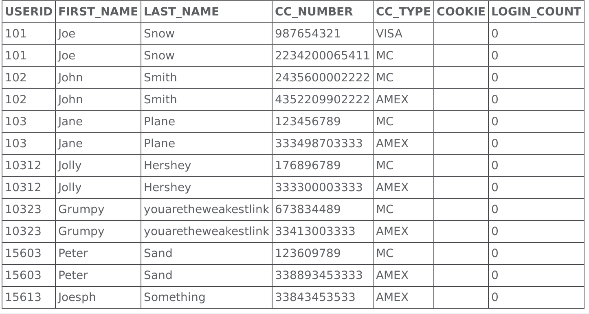
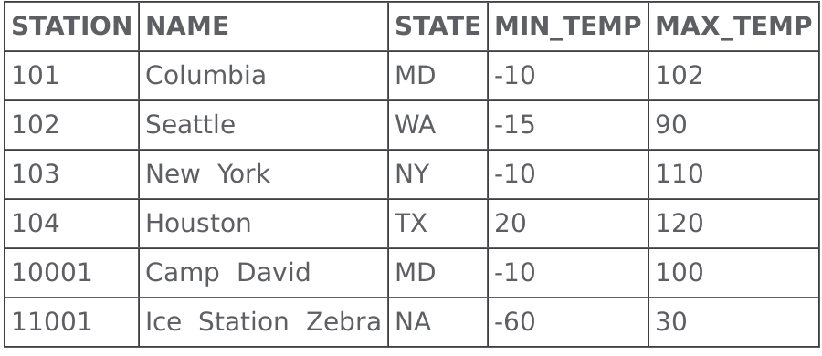
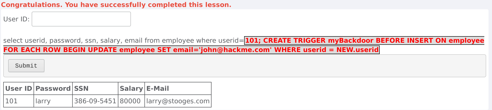
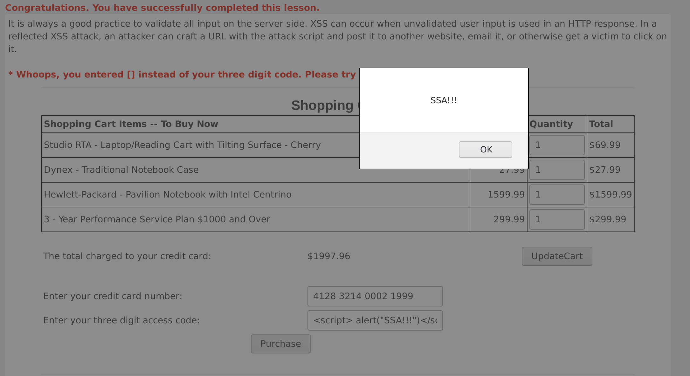
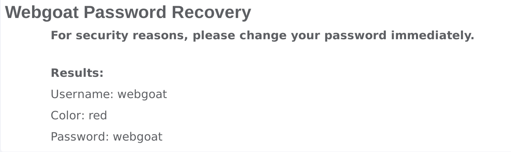
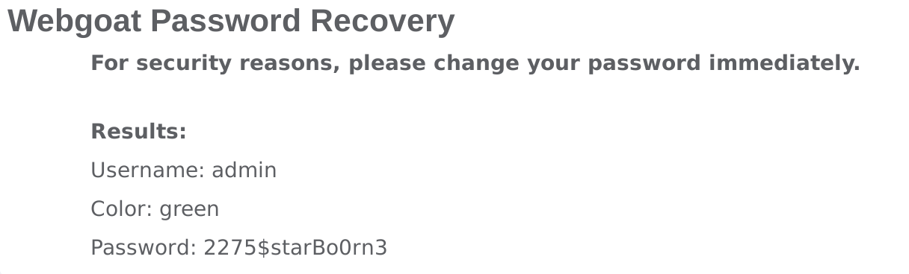

# Aula12 - Resolução

## Pergunta P1.1

1. Ao tentar utilizar alguns nomes como `Smith` ou `Nothing`, são apresentados os cartões de crédito pertencentes a uma pessoa que tenha como valor de `last_name` o valor introduzido.
2. Como não existe validação de input, é possível introduzir uma tautologia que permita que a query faça match com todos os utilizadores. Por exemplo a introdução do _input_  `Grupo12' OR '1'='1` resultará na execução da seguinte _query_ _SQL_ : `SELECT * FROM user_data WHERE last_name = 'Grupo12' OR '1'='1'`. Esta query fará _match_ com todos os registos na base de dados devido à última cláusula, visto que apresentará os registos onde o `last_name` é igual a `Grupo12` **OU** quando `'1' = '1'`, que se verifica sempre. A figura em baixo mostra o resultado obtido.

## Pergunta P1.2

1. Ao tentar utilizar com algumas estações escolhidos é possível verificar que o nome da estação é traduzido para um código que é colocado na _query_ _SQL_ como por exemplo, `Columbia` é igual a `101`.
2. Não há maneira de alterar a query, utilizando só o input.
3. Resposta em baixo na 4.
4. Ao utilizar o inspetor do firefox, podemos alterar o campo `value` que é o que é enviado quando escolhemos `Columbia` e clicámos em GO. Alterando esse value para `101 OR 1=1`, conseguimos obter todas as informações de tempo de todas as estações, como se pode ver na figura em baixo.

## Pergunta P1.3

**Passo 1**

1. A aplicação mostra uma tabela de uma linha com a pessoa indicada pelo ID 101, mostrando a sua password, o SSN, o salário e o email.
2. Para explorar a vulnerabilidade, apenas necessitámos de executar o seguinte comando: `101; UPDATE employee SET salary=80000 WHERE userid=101`. Este comando irá executar duas operações _SQL_. A primeira será coletar as informações do utilizar com o userid igual a 101. A segunda será atualizar o salário desse user para 80000.

**Passo 2**

3. A figura em baixo, mostra a correta realização do passo anteriror (salário aumentado para 80000) e a correta realização deste passo.

## Pergunta P2.1

1. Se tentarmos colocar caratéres inesperados nos campos de input, podemos tentar avaliar o tipo de validações que são feitas pelo servidor, numa tentativa de mapear possíveis pontos vulneráveis em termos de validação de input.
2. Nada a mencionar.
3. Na figura em baixo, é possível verificar o alert dado, visto que no campo do CCV foi introduzido: `` e, como neste campo, o input não estava a ser validado, permitiu explorar esse ponto vulnerável.

## Pergunta P3.1

1. A figura em baixo mostra os resultados obtidos para o utilizador `webgoat` com a cor `red`.

2. Existem normalmente utilizadores normais e os administrador. O mais proveitoso seria obter a password da conta de um administrador. Assim tentaremos comprometer a conta com username `admin`.
3. Uma simples tentativa por força bruta é suficiente, visto que à terceira tentativa conseguimos descobrir a password da conta admin, como mostra a figura em baixo.

