# Aula TP 3 - 18/Fev/2019 - Resolução

## Exercício 1
Após a realização das experiências enunciadas, tendo , nas mesmas, criado um certificado baseado em algoritmo de curvas elípticas e experimentado o processo existente de assinatura cega, o grupo resolveu a pergunta 1.1 que consistia em alterar o código das componentes da assinatura cega para tornar mais simples o processo que a mesma envolve. Essa resolução encontra-se definida e explicada na próxima secção.

### Pergunta P1.1
Na pasta _BlindSignature_, encontra-se o código alterado como pedido nesta pergunta.

**Inicialização**

O módulo `init-app.py` deve agora, obrigatoriamente ser executado de uma das seguintes formas:
- `python init-app.py`, que devolve simplesmente as _pRDashComponents_.
- `python init-app.py -init`, que inicializa devidamente as componentes necessárias (_initComponents_ e _pRDashComponents_), guardando-as num ficheiro com o nome `signer_file`.

Qualquer outra forma de execução retornará uma mensagem informando como a aplicação deve ser executada. As imagens em baixo mostram o tipo de respostas possíveis nesta aplicação, excetuando erros ocorridos no próprio processo.

Execução utilizando o comando `python init-app.py`
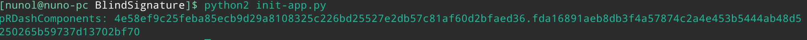

Execução utilizando o comando `python init-app.py -init`
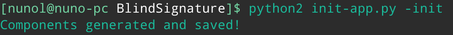

Execução utilizando o comando `python init-app.py -not` (erro)
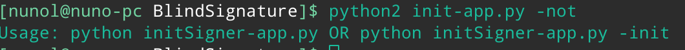

**Ofuscação**

O módulo `ofusca-app.py` deve agora, obrigatoriamente, ser executado da seguinte forma:
- `python ofusca-app.py -msg <mensagem_a_assinar> -RDash <pRDashComponents>`, devolvendo a _blind message_ e guardando as _blind components_ e as _pRComponents_ num ficheiro do requerente denominado de `req_file`.

Qualquer outra forma de execução retornará uma mensagem informando como a aplicação deve ser executada. As imagens em baixo mostram o tipo de respostas possíveis nesta aplicação, excetuando erros ocorridos no próprio processo.

Execução utilizando o comando correcto `python ofusca-app -msg <mensagem> -RDash <pRDashComponents>`.
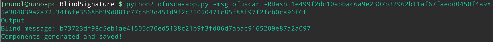

Execução utilizando um exemplo de comando errado `python ofusca-app -msg <mensagem>`.
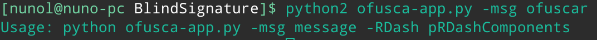

**Assinatura**

O módulo `blindSignature-app.py` deve agora, obrigatoriamente, ser executado da seguinte forma:
- `python blindSignature-app.py -key <chave_privada> -bmsg <blind_message>`, devolvendo a _blind signature_ realizada.

Qualquer outra forma de execução retornará uma mensagem informando como a aplicação deve ser executada. As imagens em baixo mostram o tipo de respostas possíveis nesta aplicação, excetuando erros ocorridos no próprio processo.

Execução utilizando o comando correcto `python blindSignature-app.py -key <chave_privada> -bmsg <blind_message>`.
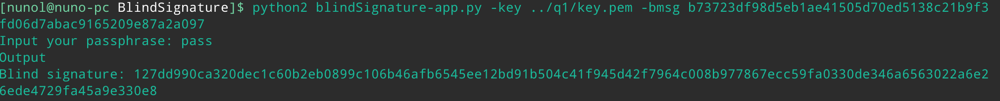

Execução utilizando o comando errado `python blindSignature-app.py -bmsg <blind_message>`.
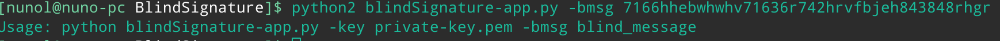

**Desofuscação**

O módulo `desofusca-app.py` deve agora, obrigatoriamente, ser executado da seguinte forma:
- `python desofusca-app.py -s <blind_signature> -RDash <pRDashComponents>`, devolvendo a assinatura retirada da _blind signature_.

Qualquer outra forma de execução retornará uma mensagem informando como a aplicação deve ser executada. As imagens em baixo mostram o tipo de respostas possíveis nesta aplicação, excetuando erros ocorridos no próprio processo.

Execução utilizando o comando correcto `python desofusca-app.py -s <blind_signature> -RDash <pRDashComponents>`.
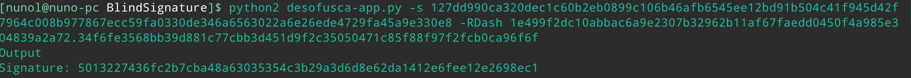

Execução utilizando o comando errado `python desofusca-app.py -s <blind_signature>`.
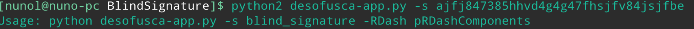

**Verificação**

O módulo `verify-app.py` deve agora, obrigatoriamente, ser executado da seguinte forma:
- `python verify-app.py -cert <certificado_assinante> -msg <mensagem_original_a_assinar> -sDash <signature> -f <ficheiro_requerente>`, retornando informação sobre a validade da assinatura.

Qualquer outra forma de execução retornará uma mensagem informando como a aplicação deve ser executada. As imagens em baixo mostram o tipo de respostas possíveis nesta aplicação, excetuando erros ocorridos no próprio processo.

Execução utilizando um comando correto e uma assinatura correcta.
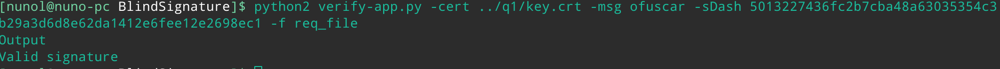

Execução utilizando um comando correto e uma assinatura errada.
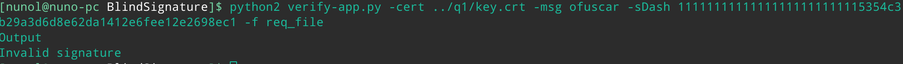

Execução utilizando um comando errado.
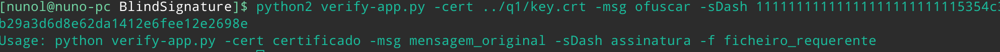

**Conclusão exercício 1**

Após todas estas alterações, a simplificação do processo de assinatura cega está concluída, como demonstrado pelas imagens anteriormente referidas. Um exemplo do `req_file` e `signer_file`, bem como o código alterado e a chave e certificado utilizados encontram-se também neste repositório dentro da pasta `Aula3`. Os ficheiros encontram-se na pasta `BlindSignature`. A chave e certificado encontram-se na pasta `q1`.


## Exercício 2

### Pergunta P2.1

Toda a informação coletada pelo SSL Server test sobre os seguintes domínios de empresas pode ser encontrada na diretoria _SSL Server Tests_.

|     Nome     |             Site             |   |   |   |   |   |   |   |   |   |
|:------------:|:----------------------------:|---|---|---|---|---|---|---|---|---|
|     OTCex    |    https://otcexgroup.com    |   |   |   |   |   |   |   |   |   |
|     Exane    |     https://www.exane.com    |   |   |   |   |   |   |   |   |   |### Pergunta P2.1
| Flow Traders | https://www.flowtraders.com/ |   |   |   |   |   |   |   |   |   |

Prosseguindo com a análise dos resultados obtidos, verificamos que apenas a empresa Exane apresenta um rating bastante negativo. Isto deve-se ao facto de o servidor encontrar-se vulnerável à [Return Of Bleichenbacher's Oracle Threat (ROBOT)](https://robotattack.org/). Não só, mas também este servidor suporta parâmetros de troca de chaves Diffie-Hellman fracos, o que limita o score para **B**, assim como a ausência de suporte para **_Forward Secrecy_**.

Resta agora perceber de que é que se trata a informação **"ROBOT (vulnerability)"**, referida em cima, para compreender o impacto que esta vulnerabilidade possui na segurança do servidor, que torna o seu rating o pior.

**_ROBOT_** significa o retorno de uma vulnerabilidade descoberta em 1998, por Daniel Bleichenbacher. Esta permitia que um atacante realizasse um ataque de texto cifrado escolhido, sobre as mensagens de erro emitidas pelo servidor _SSL_, relativamente ao padding _PKCS #1 v1.5_.

## Exercício 3

### Pergunta P3.1
As duas empresas cotadas na **Euronext** escolhidas para responder esta questão foram as seguintes:
- Orange, empresa de telecomunicações francesa.
- TELENET group, empresa provedora de serviços de internet e TV a cabo da Bélgica.

O servidor escolhido da empresa _Orange_ é o servidor com o IP **80.13.205.230**.
O servidor escolhido da empresa _TELENET_ é o servidor com o IP **78.20.86.155**.
Estes dois IPs foram retirados do _website_ _Shodan.io_.

#### P3.1.1 - Resultados ssh-audit

**Servidor Orange**
```
# general
(gen) banner: SSH-2.0-OpenSSH_7.2 FreeBSD-20160310
(gen) software: OpenSSH 7.2 running on FreeBSD (2016-03-10)
(gen) compatibility: OpenSSH 7.2+ (some functionality from 6.6), Dropbear SSH 2013.62+
(gen) compression: enabled (zlib@openssh.com, zlib)

# key exchange algorithms
(kex) curve25519-sha256@libssh.org          -- [info] available since OpenSSH 6.5, Dropbear SSH 2013.62
(kex) ecdh-sha2-nistp256                    -- [fail] using weak elliptic curves
                                            `- [info] available since OpenSSH 5.7, Dropbear SSH 2013.62
(kex) ecdh-sha2-nistp384                    -- [fail] using weak elliptic curves
                                            `- [info] available since OpenSSH 5.7, Dropbear SSH 2013.62
(kex) ecdh-sha2-nistp521                    -- [fail] using weak elliptic curves
                                            `- [info] available since OpenSSH 5.7, Dropbear SSH 2013.62
(kex) diffie-hellman-group-exchange-sha256  -- [warn] using custom size modulus (possibly weak)
                                            `- [info] available since OpenSSH 4.4
(kex) diffie-hellman-group14-sha1           -- [warn] using weak hashing algorithm
                                            `- [info] available since OpenSSH 3.9, Dropbear SSH 0.53

# host-key algorithms
(key) ssh-rsa                               -- [info] available since OpenSSH 2.5.0, Dropbear SSH 0.28
(key) rsa-sha2-512                          -- [info] available since OpenSSH 7.2
(key) rsa-sha2-256                          -- [info] available since OpenSSH 7.2

# encryption algorithms (ciphers)
(enc) aes128-cbc                            -- [fail] removed (in server) since OpenSSH 6.7, unsafe algorithm
                                            `- [warn] using weak cipher mode
                                            `- [info] available since OpenSSH 2.3.0, Dropbear SSH 0.28
(enc) aes192-cbc                            -- [fail] removed (in server) since OpenSSH 6.7, unsafe algorithm
                                            `- [warn] using weak cipher mode
                                            `- [info] available since OpenSSH 2.3.0
(enc) aes256-cbc                            -- [fail] removed (in server) since OpenSSH 6.7, unsafe algorithm
                                            `- [warn] using weak cipher mode
                                            `- [info] available since OpenSSH 2.3.0, Dropbear SSH 0.47
(enc) aes128-ctr                            -- [info] available since OpenSSH 3.7, Dropbear SSH 0.52
(enc) aes192-ctr                            -- [info] available since OpenSSH 3.7
(enc) aes256-ctr                            -- [info] available since OpenSSH 3.7, Dropbear SSH 0.52

# message authentication code algorithms
(mac) hmac-sha1                             -- [warn] using encrypt-and-MAC mode
                                            `- [warn] using weak hashing algorithm
                                            `- [info] available since OpenSSH 2.1.0, Dropbear SSH 0.28
(mac) hmac-sha2-256                         -- [warn] using encrypt-and-MAC mode
                                            `- [info] available since OpenSSH 5.9, Dropbear SSH 2013.56
(mac) hmac-sha2-512                         -- [warn] using encrypt-and-MAC mode
                                            `- [info] available since OpenSSH 5.9, Dropbear SSH 2013.56
(mac) hmac-sha1-etm@openssh.com             -- [warn] using weak hashing algorithm
                                            `- [info] available since OpenSSH 6.2
(mac) hmac-sha2-256-etm@openssh.com         -- [info] available since OpenSSH 6.2
(mac) hmac-sha2-512-etm@openssh.com         -- [info] available since OpenSSH 6.2

# algorithm recommendations (for OpenSSH 7.2)
(rec) -diffie-hellman-group14-sha1          -- kex algorithm to remove 
(rec) -ecdh-sha2-nistp256                   -- kex algorithm to remove 
(rec) -ecdh-sha2-nistp384                   -- kex algorithm to remove 
(rec) -ecdh-sha2-nistp521                   -- kex algorithm to remove 
(rec) +ssh-ed25519                          -- key algorithm to append 
(rec) -aes128-cbc                           -- enc algorithm to remove 
(rec) -aes192-cbc                           -- enc algorithm to remove 
(rec) -aes256-cbc                           -- enc algorithm to remove 
(rec) +aes128-gcm@openssh.com               -- enc algorithm to append 
(rec) +aes256-gcm@openssh.com               -- enc algorithm to append 
(rec) +chacha20-poly1305@openssh.com        -- enc algorithm to append 
(rec) -hmac-sha1                            -- mac algorithm to remove 
(rec) -hmac-sha2-256                        -- mac algorithm to remove 
(rec) -hmac-sha2-512                        -- mac algorithm to remove 
(rec) -hmac-sha1-etm@openssh.com            -- mac algorithm to remove 
(rec) +umac-128-etm@openssh.com             -- mac algorithm to append
```

**Servidor TELENET**

```
# general
(gen) banner: SSH-2.0-OpenSSH_4.3-HipServ
(gen) software: OpenSSH 4.3 (HipServ)
(gen) compatibility: OpenSSH 4.2-6.6, Dropbear SSH 0.53+ (some functionality from 0.52)
(gen) compression: enabled (zlib@openssh.com)

# key exchange algorithms
(kex) diffie-hellman-group-exchange-sha1  -- [fail] removed (in server) since OpenSSH 6.7, unsafe algorithm
                                          `- [warn] using weak hashing algorithm
                                          `- [info] available since OpenSSH 2.3.0
(kex) diffie-hellman-group14-sha1         -- [warn] using weak hashing algorithm
                                          `- [info] available since OpenSSH 3.9, Dropbear SSH 0.53
(kex) diffie-hellman-group1-sha1          -- [fail] removed (in server) since OpenSSH 6.7, unsafe algorithm
                                          `- [fail] disabled (in client) since OpenSSH 7.0, logjam attack
                                          `- [warn] using small 1024-bit modulus
                                          `- [warn] using weak hashing algorithm
                                          `- [info] available since OpenSSH 2.3.0, Dropbear SSH 0.28

# host-key algorithms
(key) ssh-rsa                             -- [info] available since OpenSSH 2.5.0, Dropbear SSH 0.28
(key) ssh-dss                             -- [fail] removed (in server) and disabled (in client) since OpenSSH 7.0, weak algorithm
                                          `- [warn] using small 1024-bit modulus
                                          `- [warn] using weak random number generator could reveal the key
                                          `- [info] available since OpenSSH 2.1.0, Dropbear SSH 0.28

# encryption algorithms (ciphers)
(enc) aes128-cbc                          -- [fail] removed (in server) since OpenSSH 6.7, unsafe algorithm
                                          `- [warn] using weak cipher mode
                                          `- [info] available since OpenSSH 2.3.0, Dropbear SSH 0.28
(enc) 3des-cbc                            -- [fail] removed (in server) since OpenSSH 6.7, unsafe algorithm
                                          `- [warn] using weak cipher
                                          `- [warn] using weak cipher mode
                                          `- [warn] using small 64-bit block size
                                          `- [info] available since OpenSSH 1.2.2, Dropbear SSH 0.28
(enc) blowfish-cbc                        -- [fail] removed (in server) since OpenSSH 6.7, unsafe algorithm
                                          `- [fail] disabled since Dropbear SSH 0.53
                                          `- [warn] disabled (in client) since OpenSSH 7.2, legacy algorithm
                                          `- [warn] using weak cipher mode
                                          `- [warn] using small 64-bit block size
                                          `- [info] available since OpenSSH 1.2.2, Dropbear SSH 0.28
(enc) cast128-cbc                         -- [fail] removed (in server) since OpenSSH 6.7, unsafe algorithm
                                          `- [warn] disabled (in client) since OpenSSH 7.2, legacy algorithm
                                          `- [warn] using weak cipher mode
                                          `- [warn] using small 64-bit block size
                                          `- [info] available since OpenSSH 2.1.0
(enc) arcfour128                          -- [fail] removed (in server) since OpenSSH 6.7, unsafe algorithm
                                          `- [warn] disabled (in client) since OpenSSH 7.2, legacy algorithm
                                          `- [warn] using weak cipher
                                          `- [info] available since OpenSSH 4.2
(enc) arcfour256                          -- [fail] removed (in server) since OpenSSH 6.7, unsafe algorithm
                                          `- [warn] disabled (in client) since OpenSSH 7.2, legacy algorithm
                                          `- [warn] using weak cipher
                                          `- [info] available since OpenSSH 4.2
(enc) arcfour                             -- [fail] removed (in server) since OpenSSH 6.7, unsafe algorithm
                                          `- [warn] disabled (in client) since OpenSSH 7.2, legacy algorithm
                                          `- [warn] using weak cipher
                                          `- [info] available since OpenSSH 2.1.0
(enc) aes192-cbc                          -- [fail] removed (in server) since OpenSSH 6.7, unsafe algorithm
                                          `- [warn] using weak cipher mode
                                          `- [info] available since OpenSSH 2.3.0
(enc) aes256-cbc                          -- [fail] removed (in server) since OpenSSH 6.7, unsafe algorithm
                                          `- [warn] using weak cipher mode
                                          `- [info] available since OpenSSH 2.3.0, Dropbear SSH 0.47
(enc) rijndael-cbc@lysator.liu.se         -- [fail] removed (in server) since OpenSSH 6.7, unsafe algorithm
                                          `- [warn] disabled (in client) since OpenSSH 7.2, legacy algorithm
                                          `- [warn] using weak cipher mode
                                          `- [info] available since OpenSSH 2.3.0
(enc) aes128-ctr                          -- [info] available since OpenSSH 3.7, Dropbear SSH 0.52
(enc) aes192-ctr                          -- [info] available since OpenSSH 3.7
(enc) aes256-ctr                          -- [info] available since OpenSSH 3.7, Dropbear SSH 0.52

# message authentication code algorithms
(mac) hmac-md5                            -- [fail] removed (in server) since OpenSSH 6.7, unsafe algorithm
                                          `- [warn] disabled (in client) since OpenSSH 7.2, legacy algorithm
                                          `- [warn] using encrypt-and-MAC mode
                                          `- [warn] using weak hashing algorithm
                                          `- [info] available since OpenSSH 2.1.0, Dropbear SSH 0.28
(mac) hmac-sha1                           -- [warn] using encrypt-and-MAC mode
                                          `- [warn] using weak hashing algorithm
                                          `- [info] available since OpenSSH 2.1.0, Dropbear SSH 0.28
(mac) hmac-ripemd160                      -- [fail] removed (in server) since OpenSSH 6.7, unsafe algorithm
                                          `- [warn] disabled (in client) since OpenSSH 7.2, legacy algorithm
                                          `- [warn] using encrypt-and-MAC mode
                                          `- [info] available since OpenSSH 2.5.0
(mac) hmac-ripemd160@openssh.com          -- [fail] removed (in server) since OpenSSH 6.7, unsafe algorithm
                                          `- [warn] disabled (in client) since OpenSSH 7.2, legacy algorithm
                                          `- [warn] using encrypt-and-MAC mode
                                          `- [info] available since OpenSSH 2.1.0
(mac) hmac-sha1-96                        -- [fail] removed (in server) since OpenSSH 6.7, unsafe algorithm
                                          `- [warn] disabled (in client) since OpenSSH 7.2, legacy algorithm
                                          `- [warn] using encrypt-and-MAC mode
                                          `- [warn] using weak hashing algorithm
                                          `- [info] available since OpenSSH 2.5.0, Dropbear SSH 0.47
(mac) hmac-md5-96                         -- [fail] removed (in server) since OpenSSH 6.7, unsafe algorithm
                                          `- [warn] disabled (in client) since OpenSSH 7.2, legacy algorithm
                                          `- [warn] using encrypt-and-MAC mode
                                          `- [warn] using weak hashing algorithm
                                          `- [info] available since OpenSSH 2.5.0

# algorithm recommendations (for OpenSSH 4.3)
(rec) -diffie-hellman-group1-sha1         -- kex algorithm to remove 
(rec) -diffie-hellman-group-exchange-sha1 -- kex algorithm to remove 
(rec) -ssh-dss                            -- key algorithm to remove 
(rec) -3des-cbc                           -- enc algorithm to remove 
(rec) -blowfish-cbc                       -- enc algorithm to remove 
(rec) -cast128-cbc                        -- enc algorithm to remove 
(rec) -arcfour                            -- enc algorithm to remove 
(rec) -arcfour128                         -- enc algorithm to remove 
(rec) -arcfour256                         -- enc algorithm to remove 
(rec) -aes128-cbc                         -- enc algorithm to remove 
(rec) -aes192-cbc                         -- enc algorithm to remove 
(rec) -aes256-cbc                         -- enc algorithm to remove 
(rec) -rijndael-cbc@lysator.liu.se        -- enc algorithm to remove 
(rec) -hmac-sha1-96                       -- mac algorithm to remove 
(rec) -hmac-md5                           -- mac algorithm to remove 
(rec) -hmac-md5-96                        -- mac algorithm to remove 
(rec) -hmac-ripemd160                     -- mac algorithm to remove 
(rec) -hmac-ripemd160@openssh.com         -- mac algorithm to remove

```

#### P3.1.2 - software e versão servidores ssh

**Servidor Orange**

Este servidor utiliza o _software_ **OpenSSH** com a versão 7.2.

**Servidor TELENET**

Este servidor utiliza o _software_ **OpenSSH** com a versão 4.3.

#### P3.1.3 - Análise do número de vulnerabilidades

Segundo os resultados fornecidos pelo _website_ [CVE Details](www.cvedetails.com), a versão 4.3 do **OpenSSH** contém 18 vulnerabilidades conhecidas e a versão 7.2 do **OpenSSH** contém 7 vulnerabilidades conhecidas, pelo que a versão 4.3 apresenta mais vulnerabilidades.

#### P3.1.4 - Gravidade das vulnerabilidades

Segundo a consulta realizada no _website_ [CVE Details](www.cvedetails.com), a vulnerabilidade mais crítica encontra-se na versão 4.3 do **OpenSSH**, com o identificador _**CVE-2006-5051**_  e com um _CVSS Score_ de 9.3.


#### P3.1.5 - Análise da gravidade de uma vulnerabilidade

A vulnerabilidade identificado no ponto anterior, na prática, é muito grave visto que a mesma tem um impacto completo em todas as propriedades de segurança (Confidencialidade, Integridade e Disponibilidade), podendo fazer com que todos os ficheiros do sistema sejam revelados ou modificados ou podendo fazer com que haja um _crash_ no sistema, tornando-o completamente indisponível. Além disso, para executar um ataque que explore esta vulnerabilidade não é preciso nenhum tipo de autenticação e a complexidade de execução do mesmo é apenas média. O sucesso na execução de um ataque deste tipo garante ao atacante privilégios de administrador. Por todos os pontos anteriormente referidos, podemos imediatamente concluir que esta vulnerabilidade é muito grave e deve ser corrigida, realizando, por exemplo, uma evolução do _software_ utilizado.

