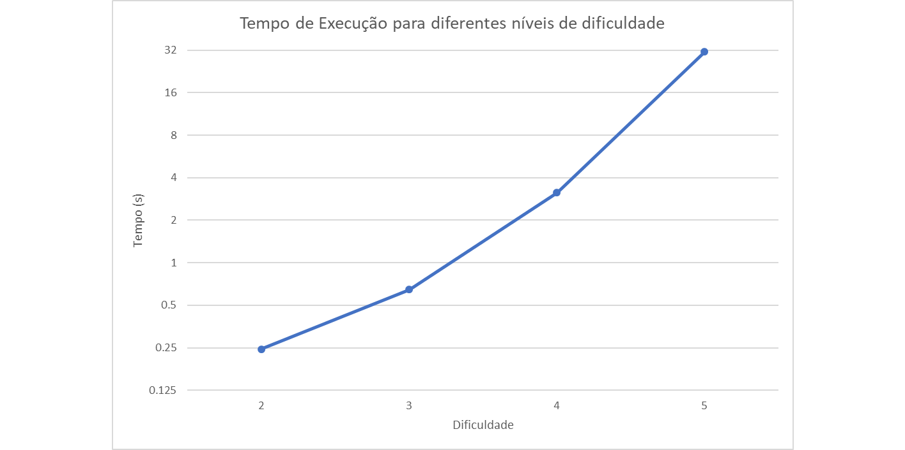

# Aula TP - 25/Mar/2019 - Resolução

Respostas às perguntas dos exercícios propostos na aula prática de 25 de março de 2019.

## Resolução dos Exercícios

### 1. Blockchain

#### Pergunta 1.1

Nesta implementação de uma blockchain, a classe *Block* é definida mediante as seguintes propriedades:

1. index - Esta é uma propriedade opcional, que pode ser passada ao construtor para indicar a posição do bloco instanciado, na blockchain;
2. timestamp - Tal como o nome indica, esta propriedade atribui um timestamp sobre quando é que o bloco foi criado;
3. data - Este parâmetro, armazena qualquer tipo de informação relevante para os utilizadores, por exemplo uma descrição de uma transação;
4. previousHash - Consiste numa string que contém o valor do hash do bloco anterior.

Posto isto, a classe *Blockchain* é implementada com base na classe anterior. Esta é inicializada pelo seu construtor, que por sua vez usa o construtor da classe *Block*, para criar o primeiro bloco da cadeia (**genesis block**).

Tendo isto em conta, o grupo alterou o método `createGenesisBlock`, de modo a que o timestamp seja a data atual e a informação para ser armazenada seja: "Bloco inicial da koreCoin". Para tal, definiu-se uma função `formatDate`, para formatar uma instância do objeto *Date* e convertê-lo para string. A informação que é passada ao construtor, foi também alterada para o que é pretendido. O código modificado pode ser encontrado na respetiva diretoria.

#### Pergunta 1.2

Tal como foi visto anteriormente, a propriedade **data** permite armazenar informação de todo o tipo, podendo ser uma descrição para uma determinada transação. Contudo, pode também descrever várias transações. Por isso, foram também adicionados alguns exemplos de blocos, que contêm várias transações em cada um deles.

Ao testar a validade da cadeia, facilmemte se verifica que esta é válida, para todos os blocos adicionados.

No código _javascript_ encontra-se um bloco contendo várias transacções no mesmo.

### 2\. Proof of Work Consensus Model

#### Pergunta P2.1

O gráfico seguinte mostra a variação do tempo necessário para minerar um bloco, em função da dificuldade do problema.

Tal como é possível verificar, à medida que a dificuldade do problema aumenta, torna-se cada vez mais trabalhoso computacionalmente, minerar um bloco.

#### Pergunta P2.2

1. O algoritmo de _proof of work_ implementado consiste no incremento de uma variável dada pelo último _proof of work_, até que esta seja divisível por 9 e pelo último _proof of work_.

2. Este algoritmo implementado para minerar é adequado, uma vez que o problema torna-se difícil de resolver, mas simples de validar. Não só, mas também como se tratam de problemas independentes, a resolução de um não altera a probabilidade de resolução dos próximos.